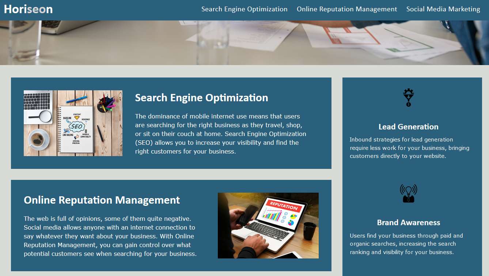

# Code Refactoring

This project demanded reworking the existing code (HTML and CSS) to identify and eliminate all existing problems.

The main goals consisted in: 
- Bringing the codebase into compliance with the accessibility standards and responsiveness
- Introducing semantic HTML into the document structure for search engine optimization
- Fixing any broken links within the page
- Improving the layout and overall look of the page (sticky navigation bar, color scheme, positioning, etc.)

Below, there are screenshots of the BEFORE and AFTER look of the site. 

# Link to the finished product

[Code Refactoring - HoriSEOn](https://bohdicave.github.io/Code_Refactor)

# Screenshots AFTER refactoring

# Screenshots BEFORE refactoring

